# Electricity Revenue Analytics Pipeline

**End-to-end Python data analysis + Power BI dashboard + Machine Learning pipeline for electricity consumer billing data**

[](https://python.org)
[](https://powerbi.microsoft.com)
[](https://scikit-learn.org)
[](https://pandas.pydata.org)
[](LICENSE)

---

## Overview

This project demonstrates a complete **data analysis, business intelligence, and machine learning pipeline** applied to **138,509 electricity consumer billing records** across 12 account categories.

It mirrors real-world revenue operations analytics — the kind used by power distribution utilities to track billing performance, identify revenue leakage, flag high-risk defaulters, and predict bad debt before it happens.

**Built by:** Shaik Abdullah — Data Analyst with 10+ years in electricity billing & revenue operations
**Live profile:** [linkedin.com/in/skbhd1-abdullah](https://linkedin.com/in/skbhd1-abdullah)

---

## Key Findings

| Metric | Value |
|---|---|
| Total consumer accounts | 138,509 |
| Total billing | 1,494,244,373 |
| Collection rate | 87.8% |
| Revenue leakage | 182M |
| 90-day debt / billing ratio | 89.7% |
| Bad debt rate | 46.2% |
| High-risk accounts flagged | 34,624 |
| Recoverable revenue (with ID) | 854M |
| ML model accuracy | **99.8%** |
| ML ROC-AUC score | **99.9%** |

---

## Project 1 — Python Revenue Analysis Pipeline

**Script:** `electricity_revenue_analysis.py`

End-to-end Python pipeline that loads, cleans, analyses and reports on 138,509 consumer billing records.

**What it does:**
- Loads and validates 138,509 rows from Excel
- Feature engineering: Revenue Leakage, Risk Segmentation, Debt Tiers, Collection Status
- Anomaly detection on collection ratios (±3 standard deviations)
- Generates 5 charts automatically
- Exports 4-sheet Excel report with 34,624 flagged high-risk accounts

**Charts generated:**

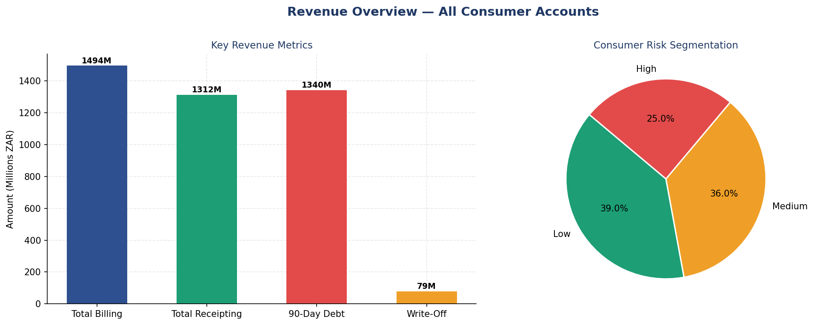
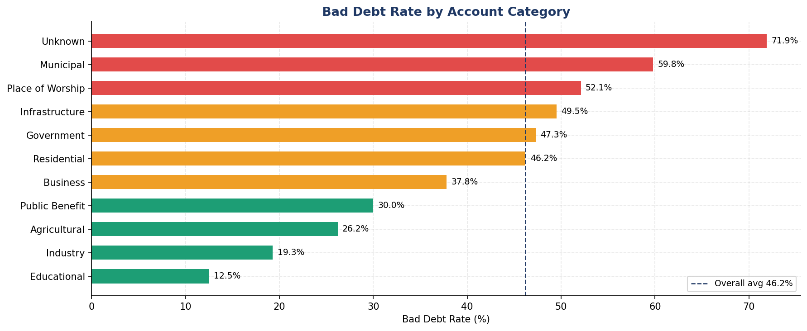
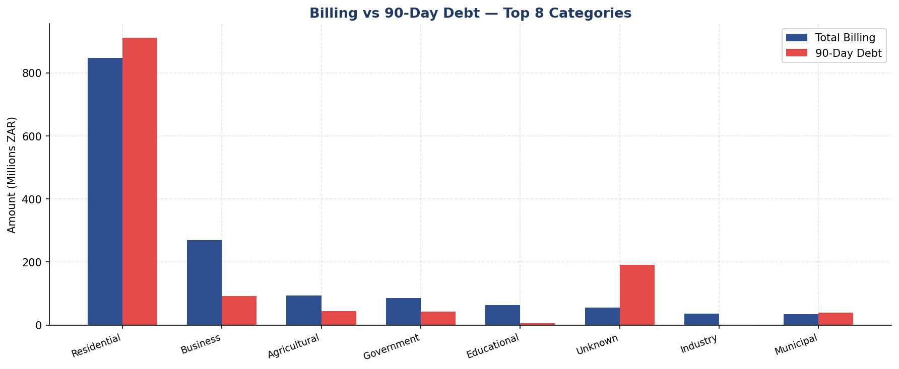
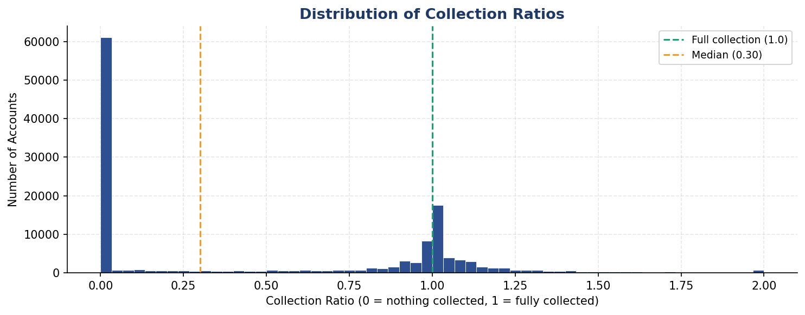
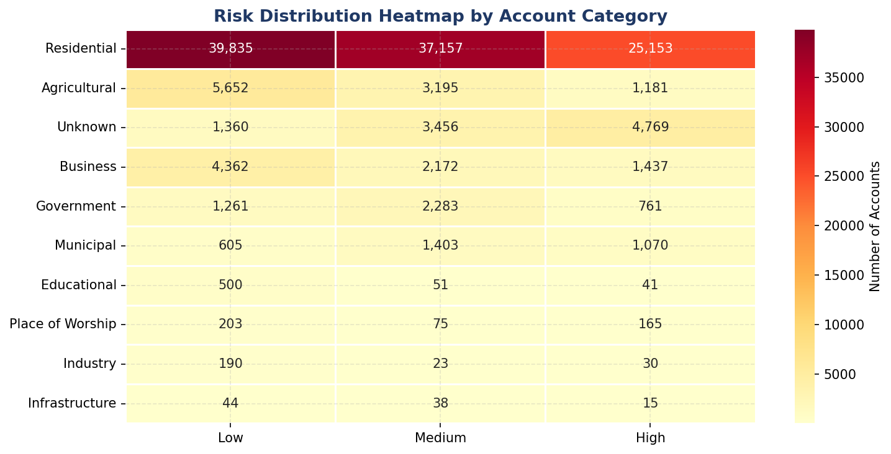

---

## Project 2 — Power BI Dashboard (3 Pages)

**File:** `Electricity_Revenue_Dashboard.pbix`

Interactive 3-page Power BI dashboard with 10+ visuals and custom DAX measures.

### Page 1 — Executive Overview
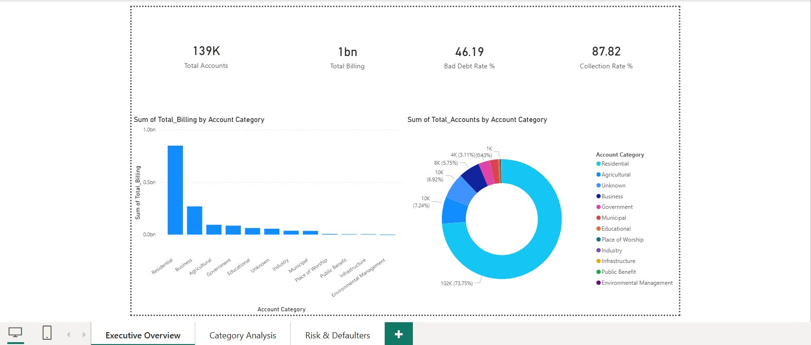

> 4 KPI cards: Total Accounts (139K), Total Billing (1.49bn), Bad Debt Rate (46.19%), Collection Rate (87.82%). Billing breakdown by category and account share donut chart.

### Page 2 — Category Analysis
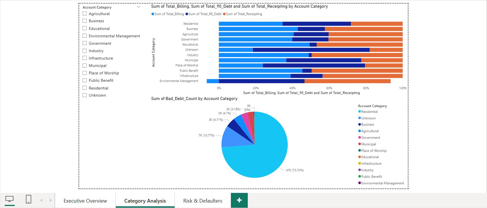

> Interactive slicer to filter by any account category. Stacked bar chart comparing Billing, 90-Day Debt and Receipting. Pie chart showing bad debt distribution.

### Page 3 — Risk & Defaulters
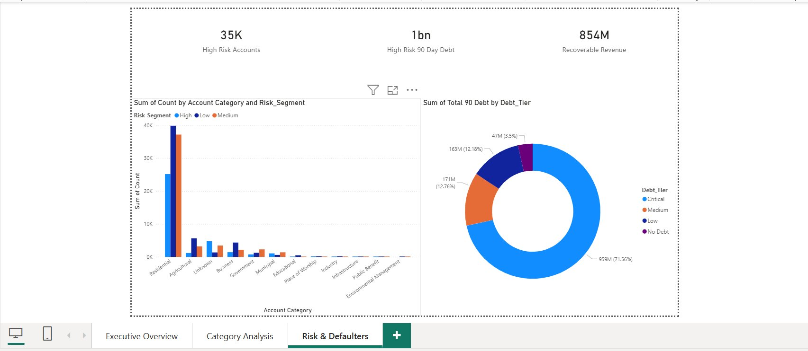

> 3 KPI cards: 35K high-risk accounts, 1bn at-risk debt, 854M recoverable revenue. Risk column chart by category. Debt tier donut showing 71.56% of debt is Critical.

---

## Project 3 — Bad Debt Risk Predictor (Machine Learning)

**Script:** `bad_debt_risk_predictor.py`

Random Forest machine learning model that predicts whether a consumer account will become bad debt — with **99.8% accuracy**.

**Model performance:**

| Metric | Score |
|---|---|
| Accuracy | 99.8% |
| ROC-AUC | 99.9% |
| Cross-Validation AUC (5-fold) | 99.9% |
| Precision (Bad Debt class) | 1.00 |
| Recall (Bad Debt class) | 1.00 |

**Top predictors of bad debt:**
1. Debt Billing Ratio
2. Total 90 Day Debt
3. 90-Day Debt Amount (log)
4. Revenue Leakage Ratio
5. Collection Ratio

**Charts generated:**

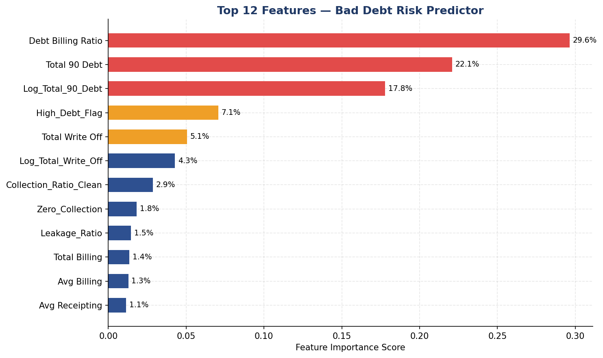
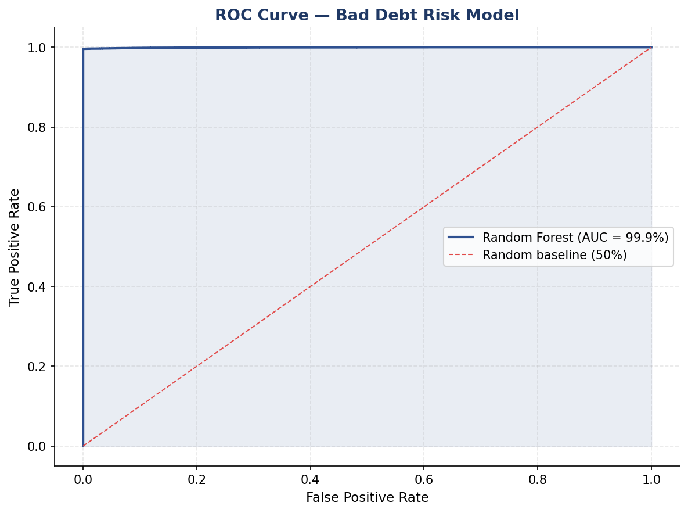
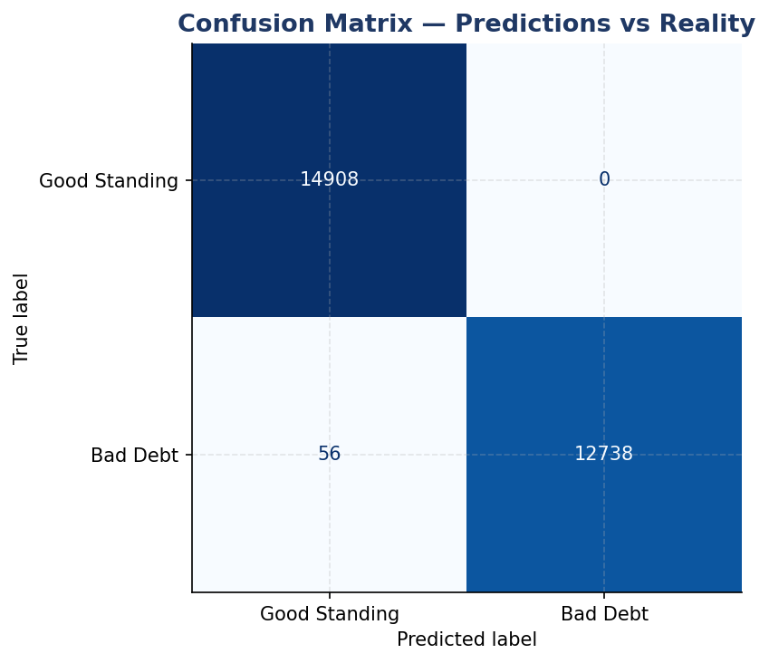
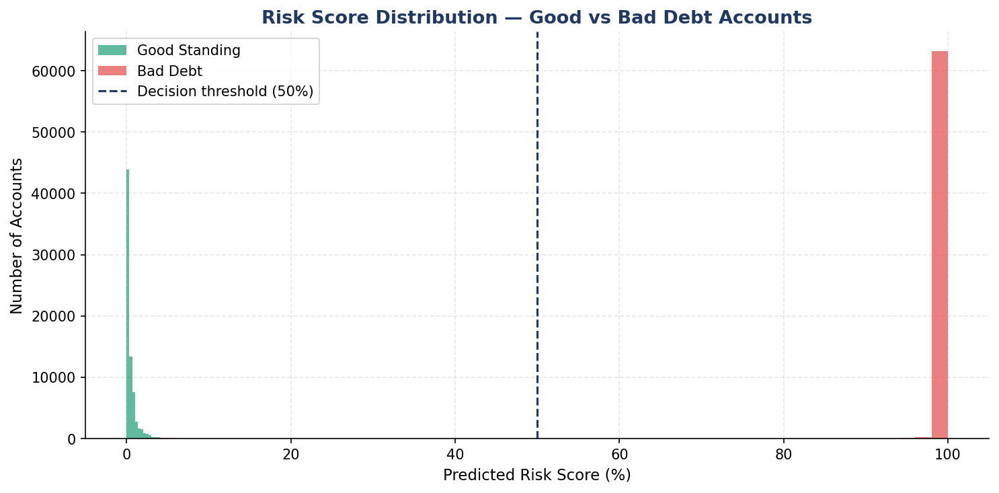
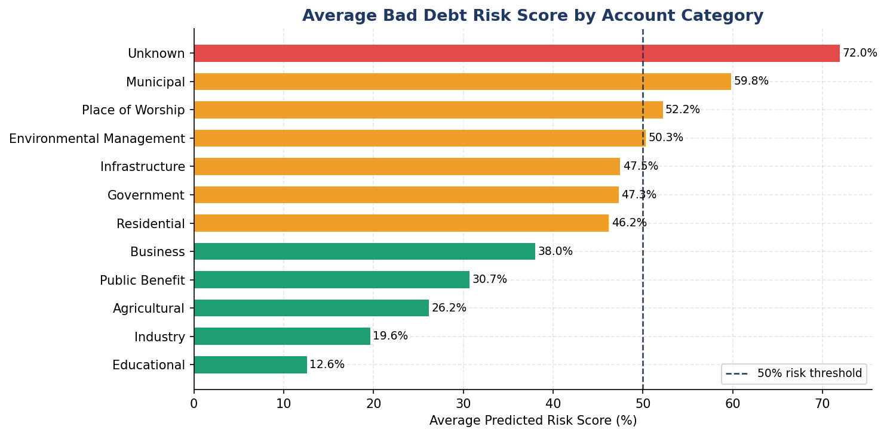

**Output report (Excel — 5 sheets):**

| Sheet | Contents |
|---|---|
| Model Performance | Accuracy, AUC, CV scores |
| Risk by Category | Average risk score per category |
| Top 5000 High Risk | Highest risk accounts prioritised |
| Feature Importance | Which factors drive bad debt |
| All Accounts with Score | Full dataset with risk scores |

---

## Tech Stack

| Tool | Purpose |
|---|---|
| Python 3.10+ | Core language |
| pandas | Data loading, cleaning, transformation |
| NumPy | Feature engineering, anomaly detection |
| matplotlib | Chart generation |
| seaborn | Heatmap visualisation |
| scikit-learn | Random Forest model, cross-validation, ROC-AUC |
| openpyxl | Multi-sheet Excel export |
| Power BI Desktop | Interactive 3-page dashboard |
| DAX | Custom measures and KPI calculations |

---

## How to Run

```bash
# 1. Clone the repo
git clone https://github.com/skbhd1/electricity-revenue-analytics.git
cd electricity-revenue-analytics

# 2. Install dependencies
pip install pandas numpy matplotlib seaborn openpyxl scikit-learn

# 3. Place your dataset in the root folder
# File: Project_Data_Set_-_27_03_2026.xlsx

# 4. Run Project 1 — Python analysis pipeline
python electricity_revenue_analysis.py

# 5. Run Project 3 — ML risk predictor
python bad_debt_risk_predictor.py
```

Outputs are saved to `outputs/` and `ml_outputs/` folders automatically.

---

## Project Structure

```
electricity-revenue-analytics/
│
├── electricity_revenue_analysis.py     # Project 1 — Python pipeline
├── bad_debt_risk_predictor.py          # Project 3 — ML model
├── PowerBI_Dataset.xlsx                # Power BI ready dataset
├── README.md                           # This file
│
├── Power BI Dashboard screenshots
│   ├── page1_executive_overview.png
│   ├── page2_category_analysis.png
│   └── page3_risk_defaulters.png
│
├── Python pipeline outputs
│   ├── 01_revenue_overview.png
│   ├── 02_bad_debt_by_category.png
│   ├── 03_billing_vs_debt_by_category.png
│   ├── 04_collection_ratio_distribution.png
│   └── 05_risk_heatmap.png
│
└── ML model outputs
    ├── ml_01_feature_importance.png
    ├── ml_02_roc_curve.png
    ├── ml_03_confusion_matrix.png
    ├── ml_04_risk_score_distribution.png
    └── ml_05_risk_by_category.png
```

---

## Dataset

**Source:** Public electricity consumer billing dataset
**Size:** 138,509 rows × 16 columns
**Domain:** Electricity distribution / Revenue operations

**Columns:** Account Category, Property Value, Property Size, Total Billing, Avg Billing, Total Receipting, Avg Receipting, Total 90 Debt, Total Write Off, Collection Ratio, Debt Billing Ratio, Total Elec Bill, Has ID No, Bad Debt

> The dataset does not contain personally identifiable information (PII).

---

## Author

**Shaik Abdullah**
Data Analyst | Revenue Operations | Python | Power BI | Machine Learning
10+ years in electricity billing analytics at TGSPDCL/TSSPDCL, Telangana

- LinkedIn: [linkedin.com/in/skbhd1-abdullah](https://linkedin.com/in/skbhd1-abdullah)
- GitHub: [github.com/skbhd1](https://github.com/skbhd1)
- Email: skbhd1@gmail.com
